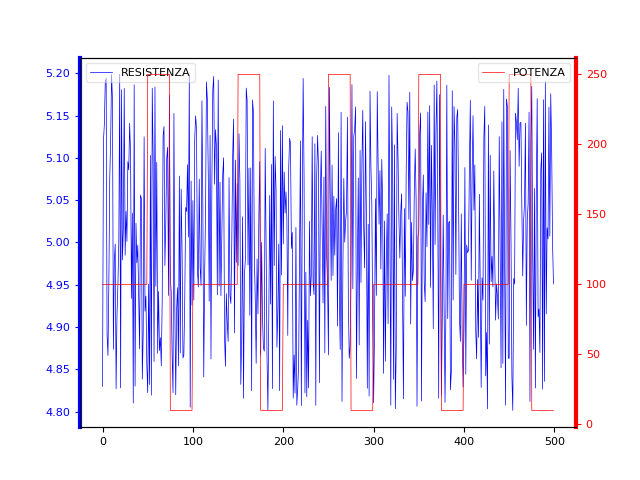
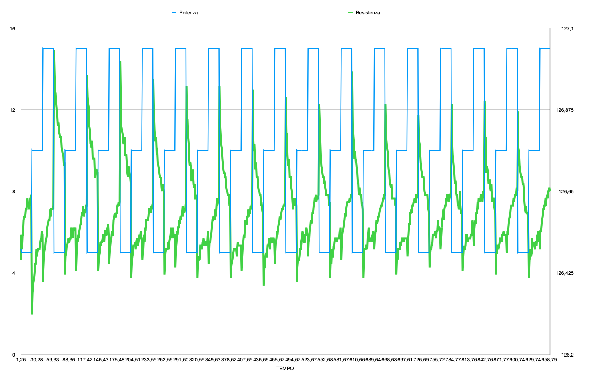
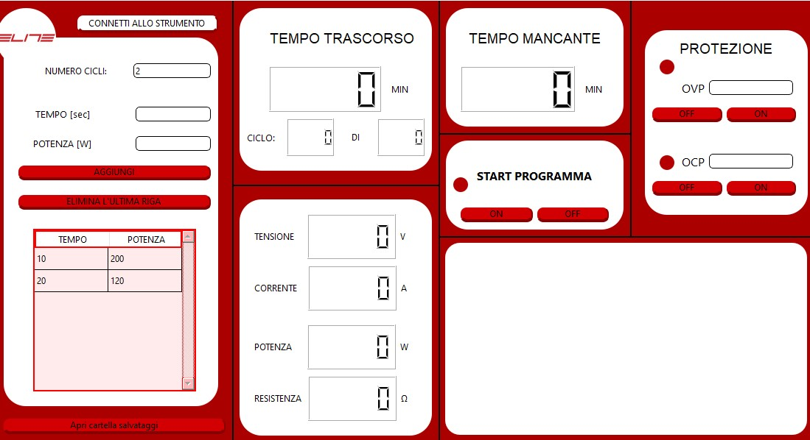

# PyVisa-Controller

Breve presentazione

Questo progetto fornisce una semplice interfaccia grafica per controllare un alimentatore tramite PyVISA. L'interfaccia permette di impostare tensione e corrente, leggere i valori misurati e visualizzare grafici dei dati acquisiti.

Funzionalità principali

- Controllo remoto dell'alimentatore via PyVISA
- Visualizzazione real-time dei dati e grafici
- Esportazione/visualizzazione CSV

Esempio di utilizzo

1. Assicurati di avere installato le dipendenze (ad esempio `pyvisa`).
2. Avvia l'app con:

```
python alimentatore_GUIV2.py
```

Screenshot

Di seguito alcuni screenshot registrati durante l'uso dell'applicazione:







Contribuire

Apri una issue o fai una pull request per suggerire miglioramenti.

